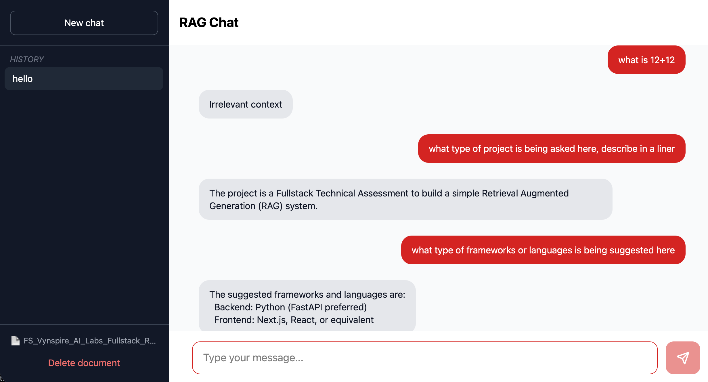

# RAG Chat

A Retrieval-Augmented Generation (RAG) system that allows users to upload documents and ask questions about them through a conversational interface with FastAPI and SvelteKit.



## Architecture

```
┌─────────────┐     ┌─────────────┐     ┌─────────────────┐
│   Svelte    │────▶│   FastAPI   │────▶│   PostgreSQL    │
│  Frontend   │◀────│   Backend   │◀────│   + pgvector    │
└─────────────┘     └──────┬──────┘     └─────────────────┘
                           │
                           ▼
                    ┌─────────────┐
                    │  Gemini API │
                    │ (Embeddings │
                    │   + LLM)    │
                    └─────────────┘
```

### Key Design Decisions

**Vector Database:** PostgreSQL with pgvector in Docker:
- Persistence without extra infrastructure
- Transactional integrity with document metadata
- Simpler deployment (single database for all data)

**Chunking Strategy:** RecursiveCharacterTextSplitter with 1000 char chunks and 100 char overlap ensures:
- Chunks are large enough to preserve context
- Overlap prevents information loss at boundaries
- Recursive splitting respects natural text boundaries (paragraphs, sentences)

**Embedding Model:** Gemini's `gemini-embedding-001` with 768 dimensions provides good semantic representation while keeping storage reasonable.

**Retrieval:** Top 5 chunks via L2 distance is a balanced default—enough context without overwhelming the LLM's context window.

## Tech Stack

- **Backend:** Python, FastAPI
- **Frontend:** SvelteKit, TailwindCSS
- **Database:** PostgreSQL with pgvector extension
- **LLM:** Google Gemini (free tier)

## Prerequisites

- Docker & Docker Compose
- Gemini API key


## Setup 

### 1. Clone and configure

```bash
git clone <repository-url>
cd RAGChat

cp .env.example .env
# Edit .env and add your GEMINI_API_KEY
```

### Environment Variables

| Variable | Description | Default |
|----------|-------------|---------|
| `GEMINI_API_KEY` | Your Google Gemini API key | (required) |
| `FRONTEND_URL` | URL where the frontend runs | `http://localhost:5173` |
| `VITE_API_URL` | Backend API URL for the frontend | `http://localhost:8000` |

### 2. Start the database

```bash
docker compose up -d
```

### 3. Start the backend

```bash
cd backend
python -m venv env
source env/bin/activate  # On Windows: env\Scripts\activate
pip install -r requirements.txt
fastapi dev main.py
```

The API will be available at `http://localhost:8000`

### 4. Start the frontend

```bash
cd frontend
npm install
npm run dev
```

The app will be available at `http://localhost:5173`

## Usage

1. Open `http://localhost:5173` in your browser
2. Upload a PDF, TXT, or Markdown file
3. Ask questions about the document in the chat interface

## API Endpoints

| Method | Endpoint | Description |
|--------|----------|-------------|
| POST | `/upload` | Upload and process a document |
| POST | `/chat` | Send a message and get a response |
| GET | `/documents/status` | Check if documents are uploaded |
| GET | `/conversations` | List all conversation sessions |
| GET | `/chat/history/{id}` | Get messages for a conversation |
| DELETE | `/clear-documents` | Remove all documents and history |

## Project Structure

```
RAGChat/
├── backend/
│   ├── main.py          # FastAPI app, endpoints, RAG logic
│   ├── database.py      # SQLAlchemy models, DB setup
│   ├── models.py        # Pydantic request/response schemas
│   └── requirements.txt
├── frontend/
│   └── src/
│       ├── routes/      # SvelteKit pages
│       └── lib/
│           ├── api.js        # Backend API client
│           └── components/   # UI components
├── docker-compose.yaml  # PostgreSQL + pgvector
└── README.md
```
